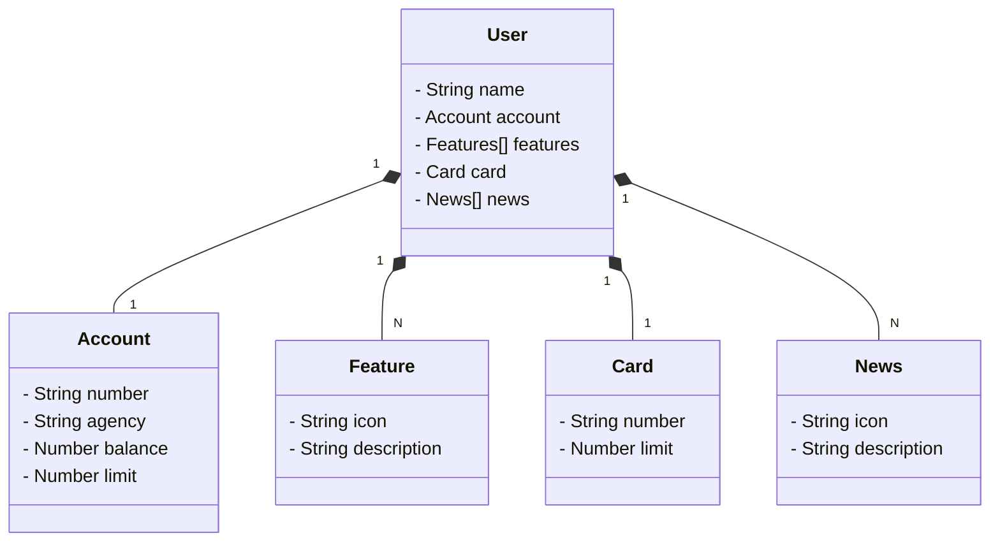

# Santander Dev Week
Criando um API Restful com Spring Boot 3 e Railway, projeto feito durante a Santander Dev Week 2023.

## Diagrama de Classes

<h6 align="center"><a href="https://sdw-2023-api-prd.up.railway.app/swagger-ui/index.html">**Link para testar o projeto**</a></h6>

## Principais Tecnologias
* Java
* Spring Boot
* Spring JPA
* OpenAPI (Swagger)
* Railway

  

  

<h3>Contribuindo</h3>
⭐️ Star o projeto
🐛 Encontrar e relatar issues
  
